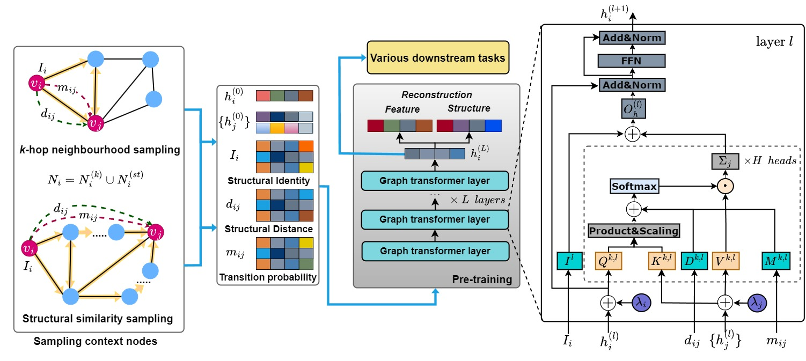

# Unified Graph Transformer
Unified Graph Transformer (UGT) is a novel Graph Transformer model specialised in preserving both local and global graph structures and developed by [NS Lab, CUK](https://nslab-cuk.github.io/) based on pure [PyTorch](https://github.com/pytorch/pytorch) backend. The paper is available [on arXiv](https://arxiv.org/)

<p align=center>
  <a href="https://www.python.org/downloads/release/python-360/">
    =3.8.8-3776AB?logo=python&style=flat-square" alt="Python">
  </a>    
  <a href="https://github.com/pytorch/pytorch">
    =1.4-FF6F00?logo=pytorch&style=flat-square" alt="pytorch">
  </a>    
  
  
  
  
  
  
  
</p>

<br>


## 1. Overview

Over the past few years, graph neural networks and graph transformer models have been successfully used to analyze graph-structured data, mainly focusing on node classification and link prediction tasks. However, the existing studies mostly only consider local connectivity while ignoring long-range connectivity and the roles of nodes. In this paper, we propose Unified Graph Transformer Networks (UGT) that effectively integrate local and global structural information into fixed-length vector representations. First, UGT learns local structure by identifying the local substructures and aggregating features of the k-hop neighborhoods of each node. Second, we construct virtual edges, bridging distant nodes with structural similarity to capture the long-range dependencies. Third, UGT learns unified representations through self-attention, encoding structural distance and p-step transition probability between node pairs. Furthermore, we propose a self-supervised learning task that effectively learns transition probability to fuse local and global structural features, which could then be transferred to other downstream tasks. Experimental results on real-world benchmark datasets over various downstream tasks showed that UGT significantly outperformed baselines that consist of state-of-the-art models. In addition, UGT reaches the third-order Weisfeiler-Lehman power to distinguish non-isomorphic graph pairs.

<br>

<p align="center">
  
  <br>
  <b></b> The overall architecture of Unified Graph Transformer Networks.
</p>


## 1. Requirements and Environment Setup

The source code developed in Python 3.8.8. UGT are built using Torch-geometric 2.3.1 and DGL 1.1.0. Please refers to official websites for installation and setup.
All the requirements are included in environment.yml file. 

```
# Conda installation

# Install python environment

conda env create -f environment.yml 

```

<br>

## 2. Reproducibility

<br>

### 2.1. Datasets


The package ```Node_level_tasks``` contains the modules required for node clustering and node classification task, ```Graph_classification``` is for graph classification task, and  ```IsomorphismTesting``` is for Isomorphism testing.
For the node-level tasks, we used eleven publicly available datasets, which are grouped into three different domains, including Air-traffic networks (e.g., Brazil, Europe, and USA), Webpage networks (e.g., Chameleon, Squirrel, Actor, Cornell, Texas, and Wisconsin), and Citation networks (e.g., Cora and Citeseer). We used four publicly available datasets for the graph classification task, including Enzymes, Proteins, NCI1, and NCI9 from TUDataset. Furthermore, we used Graph8c and five Strongly Regular Graphs datasets (graph8c, SR251256, SR261034, SR281264, SR401224), which contain 1d-WL and 3d-WL equivalent graph pairs, respectively, for isomorphism testing. The datasets are automatically downloaded.
<br>

### 2.2. Hyperparameters

Following Options can be passed to exp_10.py

```--dataset:``` The name of datasets. For example: ```--dataset cora```

```--lr:``` Learning rate for training the model. For example: ```--lr 0.001```

```--epochs:``` Number of epochs for training the model. For example: ```--epochs 1000```

```--layers:``` Number of layers for training the model. For example: ```--layers 4```

```--task:``` The specific task. For example: ```--task pre_training```.

```--pre_load:``` The processing mode, including pre-processing and training. For example: ```--pre_load 0``` for pre-preprocessing data.

```--dims:``` The dimmension of hidden vectors.  For example: ```--dims 16```.

```--k_transition:``` The number of transition step. For example: ```--k_transition 6```.

```--k_hop:``` The number of hop for sasmpling. For example: ```--k_hop 2```.

```--alpha:``` Hyperparameters for transition construction loss. For example: ```--alpha 0.4```.

```--beta:``` LHyperparameters for feature construction loss. For example: ```--beta 0.6```.

<br>

### 2.3. Node-level Tasks

The the source code for node clustering and node classification are included in the ```Node_level_tasks``` folder. 
We do experiments on eleven public benchmark datasets, including cora, citeseer, brazil, europe, usa, chameleon, squirrel, film, cornell,  texas, and wisconsin. The datasets are automatically downloaded.
Note that one can test node classification and node clustering task followed by pre-training tasks. 
We sample k-hop neighbourhood and virtual edges in the pre-processing step and save the pre-processing data in the ```pts``` and ```outputs``` folders.

```
# cd Node_level_tasks

# Pre-preprocessing data

python exp_10.py --dataset cora --pre_load 1

# Pre_training

python exp_10.py --dataset cora --task pre_training --pre_load 0

# Running Node classification task:

python exp_10.py --dataset cora --task node_classification --pre_load 0 --lr 0.001 --dims 16 --k_hop 1 --num_layers 2 --k_transition 6 --alfa 0.5 --beta 0.5

# Running Node clustering task:

python exp_10.py --dataset cora --task node_clustering --pre_load 0 --lr 0.001 --dims 16 --k_hop 1 --num_layers 2 --k_transition 6 --alfa 0.5 --beta 0.5

```

<br>

### 2.4. Graph-level Classification Task

The the source code for Graph-level classification task is included in the ```Graph_classification``` folder. 
We do experiments on four public benchmark datasets, including Enzymes, Proteins, NCI1, and NCI9 from TUDataset. The datasets are automatically downloaded.

```
cd Graph_classification

# Pre-processing:

python exp_10.py --dataset PROTEINS --pre_load 1 --task graph_classification

# Graph classification task:

python exp_10.py --dataset PROTEINS --pre_load 0 --task graph_classification

```
<br>

### 2.5. Isomorphism Testing

There are five graph datasets, including Graph8c and five Strongly Regular Graphs datasets (SR251256, SR261034, SR281264, SR401224), which contain 1d-WL and 3d-WL equivalent graph pairs, respectively. For example, one can test the power of UGT on sr16622 dataset: 

```
python exp_10.py --dataset sr16622 --task iso_test
```

<br>

## 3. Reference

:page_with_curl: Paper [on arXiv](https://arxiv.org/)

:pencil: Blog [on Network Science Lab](https://nslab-cuk.github.io/)


<br><br><br>

